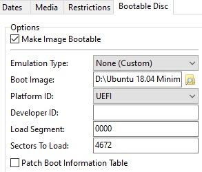

# Ubuntu 18.04 LTS Minimal with UEFI

A guide to building an ISO image for the Ubuntu 18.04 LTS Minimal installer which does not support UEFI out of the box.

## Prebuilt ISO

If you would like to save youself the hassle of building your own ISO, you can use [this one](Ubuntu18.04LTSMinimalUEFINetInstallerUnscripted.iso). It does not contain the `ks.cfg` for automated installing. If you want to use this feature, you will need to go through the process yourself.

## Documentation

### Prerequisites

Starting off, you will need access to both the [Ubuntu 18.04 LTS Minimal](http://archive.ubuntu.com/ubuntu/dists/bionic-updates/main/installer-amd64/current/images/netboot/mini.iso) and the [Ubuntu 18.04.2 LTS Server AMD64](http://cdimage.ubuntu.com/releases/18.04/release/) images.

Furthermore, a linux environment as well as a windows environment make things easier. Starting in the linux environment, the farther we progress, we switch up to windows.

Although I need to mention that all this can also be accomplished with linux alone, the second part using ImgBurn is then substituted with the [`mkisofs`](https://wiki.ubuntuusers.de/mkisofs/) command. But as this is more difficult, you will get the impression here. In case Windows is not an option, you will need to lookup the correct flags for `mkisofs`.

### Step 0 - Cloning the GIT repository

You can clone this repository to whereever you want on your system. Just use

``` BASH
cd && mkdir UbunutuMinimalUEFI && cd UbunutuMinimalUEFI && git clone -- https://github.com/Andevour/Ubuntu-18.04-LTS-Minimal-UEFI-NetInstaller.git .
```

### Step 1 - Setup of images under Linux

There are two options. The first and easiest would be executing the [`patch.sh`](https://noobient.com/2019/06/25/ubuntu-18-04-uefi-network-installer/) script in the `images` directory. It will download the needed images, namely `mini.iso` and `ubuntu-18.04.2-server-amd64.iso`. It will patch the `mini.iso` in a way that certain files, obviously those needed for UEFI boot, are being copied together in a new folder that is named `ubuntu-18.04-netinstall`.

The script therefore relies on `wget` doing its job. If the URLs provided to wget fail, the script as whole will fail. In case that happens, you will need to download the images yourself, place them in the `images` directory and rename them, respectively to  `mini.iso` and `ubuntu-18.04.2-server-amd64.iso`.

The script also contains the copy command for the `ks.cfg`, a config file for [Ubuntu's automated install](https://help.ubuntu.com/lts/installation-guide/i386/ch04s06.html). If you are not familiar with it or just wish to not use it, don't worry, you will not need to use it nor will it hinder you. If you want to use automated install, you will likely need to customize the `ks.cfg` to your needs. The script will deploy it for you.

Make the script `patch.sh` executable if it isn't. Afterwards, execute it. The script will give you a live indication of what's going on. After it finishes, the images folder will contain the folder `ubuntu-18.04-netinstall`.

``` BASH
cd ~/UbuntuMinimalUEFI/resources/creation/ && sudo chmod +x patch.sh
./patch.sh
```

## Step 2 - Creating a functioning ISO under Windows

The next step is to create the actual ISO image, that could be used with say VMware or burned to a pen drive. Here you would need to switch to Windows, for ease of use. The small programm [ImgBurn](http://www.imgburn.com/index.php?act=download) does the job. Copy the `images` directory over to Windows.

After installing it, open it up and choose the *build* mode ("create image file files/folders"). As for the source, you will need to select the `ubuntu-18.04-netinstall` folder. As for destination, choose your desired destination folder and add the desired name of your ISO at the end. The important part is hidden under the *Advanced / Bootable Disc* tab. Here you wil need to make changes according to this picture:



The *Boot Image* can be found under `ubuntu-18.04-netinstall\boot\grub\efi.img`. Leave everything else as is.

You can then start the build process. You are prompted with the message saying you had only selected one folder. Just accept with yes, then again accept with yes, and last but not least, click ok. That's it, you are done. The ISO you created should load up GRUB in EFI mode. You can find detailed information about the process of building the ISO [here](DOC.md).

## Sources

There are articles that need to be credited, because without them, this guide would not have been possible.

1. [How do I create an EFI-bootable ISO of a customized version of Ubuntu?](https://askubuntu.com/questions/457528/how-do-i-create-an-efi-bootable-iso-of-a-customized-version-of-ubuntu)
2. [Ubuntu 18.04 UEFI network installer](https://noobient.com/2019/06/25/ubuntu-18-04-uefi-network-installer/)
3. [Ubuntu Kickstart template](https://github.com/vrillusions/ubuntu-kickstart/blob/master/18.04/ks-1804-minimalvm.cfg)
4. [Ubuntu automated installation](https://help.ubuntu.com/lts/installation-guide/i386/ch04s06.html)
